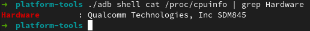

# 1. Introducción: conceptos y soporte físico
**Ejercicio 1.** Consultar en el catálogo de alguna tienda de informática el precio de un ordenador tipo servidor y calcular su coste de amortización a cuatro y siete años. [Consultar este artículo en Infoautónomos sobre el tema](https://www.infoautonomos.com/consultas-a-la-comunidad/988/).

Para el caso de equipos de proceso de información, su amortización lineal máxima según la [web de la Agencia Tributaria](https://www.agenciatributaria.es/AEAT.internet/Inicio/_Segmentos_/Empresas_y_profesionales/Empresas/Impuesto_sobre_Sociedades/Periodos_impositivos_a_partir_de_1_1_2015/Base_imponible/Amortizacion/Tabla_de_coeficientes_de_amortizacion_lineal_.shtml) es de un 25%. En este caso, seleccionaré [este servidor](https://www.dell.com/es-es/work/shop/cty/pdp/spd/poweredge-r940xa/emea_r940xa_vi_vp) para calcular su amortización. Como podemos ver, el precio viene sin el IVA incluido, por lo que me ahorro ese cáclulo. Los costes de amortización son los siguientes:
- Para 4 años, la amortización será del 25%, por tanto el coste de amortización será 20.291,22€ por año.
- Para 7 años, la amortización será del 100/7=14,29%, por tanto el coste de aortización será 11.598,46€ por año.

**Ejercicio 2.** Usando las tablas de precios de servicios de alojamiento en Internet “clásicos”, es decir, que ofrezcan Virtual Private Servers o servidores físicos, y de proveedores de servicios en la nube, comparar el coste durante un año de un ordenador con un procesador estándar (escogerlo de forma que sea el mismo tipo de procesador en los dos vendedores) y con el resto de las características similares (tamaño de disco duro equivalente a transferencia de disco duro) en el caso de que la infraestructura comprada se usa solo el 1% o el 10% del tiempo.

|                | **OVHcloud (VPS)** | **Digital Ocean (Cloud)** |
|:--------------:|:------------------:|:-------------------------:|
|     **CPU**    |       1 vCPU       |           1 vCPU          |
|   **Memoria**  |         2GB        |            2GB            |
| **Capacidad(SSD)** |        40GB        |            50GB           |
|   **Precio**   |       [5.52$/mes](https://us.ovhcloud.com/vps/)       |         [0.015$/hora](https://www.digitalocean.com/pricing/?utm_campaign=emea_brand_kw_en_cpc&utm_adgroup=digitalocean_pricing_exact&_keyword=digital%20ocean%20pricing&_device=c&_adposition=&utm_medium=cpc&utm_source=google&gclid=CjwKCAjw_NX7BRA1EiwA2dpg0tczFAbvkBiAklTpwkgG91KFAm-9BVAU5neVHe7mK_7y6Ydfg8hrlRoCWSMQAvD_BwE#basic-droplets)        |

En el caso del VPS, da igual qué porcentaje del tiempo lo hemos usado, nos van a cobrar el mes entero al hacer el alquiler, da igual cuanto lo usemos. Por tanto, saldría a 66.24$/año. 

En el caso del Cloud, si lo usamos el 1% de las horas de un año (87.6h) saldría a 1,31$/año y en el caso de usarlo el 10% de las horas del año (876h) saldría a 13.14\$/año.

Como podemos observar, en caso de usar el servidor unas pocas horas al año sale más rentable usar un Cloud.

**Ejercicio 3.** En general, cualquier ordenador con menos de 5 o 6 años tendrá estos flags. ¿Qué modelo de procesador es? ¿Qué aparece como salida de esa orden? Si usas una máquina virtual, ¿qué resultado da? ¿Y en una Raspberry Pi o, si tienes acceso, [el procesador del móvil](https://stackoverflow.com/questions/26239956/how-to-get-specific-information-of-an-android-device-from-proc-cpuinfo-file)?

- En mi PC:

    

    

- En mi móvil (tengo el Qualcomm Snapdragon 845)

    

    En android me aparece lo siguiente, pero ninguna de esa Feature se refiere a virtualización

    

- En el subsistema de windows para linux

    

    

**Ejercicio 4.** Instalar un hipervisor para gestionar máquinas virtuales, que más adelante se podrá usar en pruebas y ejercicios. Usar siempre que sea posible un hipervisor que sea software libre.

Voy a instalar VirtualBox, puesto que es el que usaba en la asignatura Ingeniería de Servidores y es software libre.

**Ejercicio 5.** Darse de alta en una web que permita hacer pruebas con alguno de los sistemas de gestión de nube libres como los mencionados en los párrafos anteriores, aunque sea temporalmente. Si la prueba es menos de un mes, simplemente anotarlo y dejarlo para el mes de diciembre, más o menos.

Ahora mismo estoy dado de alta en [Amazon Web Services](https://cloud.google.com/) en el cual tengo un año de prueba gratis y ofrecen lo siguiente:

