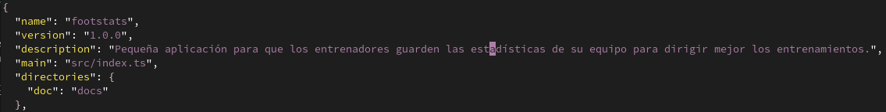
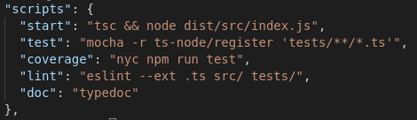

# Desarrollo basado en pruebas
**Ejercicio 1.** Descargar y ejecutar las pruebas de alguno de los proyectos anteriores, y si sale todo bien, hacer un pull request a alguno de esos proyectos con tests adicionales, si es que faltan (en el momento que se lea este tema).

Ya tengo un proyecto al que le puedo ejecutar los tests (el que estoy desarrollando para esta misma asignatura).

**Ejercicio 2.** Para la aplicación que se está haciendo, escribir una serie de aserciones y probar que efectivamente no fallan. Añadir tests para una nueva funcionalidad, probar que falla y escribir el código para que no lo haga (vamos, lo que viene siendo TDD).

Ya están hechos los tests de la aplicación que estoy desarrollando para esta asignatura. El directorio de tests se puede consultar [aquí](https://github.com/ManuelJNunez/footStats/tree/master/tests)

**Ejercicio 3.** Crear algún conjunto de scripts de tests, usando tu lenguaje favorito, y ejecutarlos desde el marco de test más adecuado (o el que más te guste) para ese lenguaje.

Ya he creado un conjunto de tests usando TypeScript y mocha+chai (ver ejercicio 2).

**Ejercicio 4.** Instalar alguno de los entornos virtuales de node.js (o de cualquier otro lenguaje con el que se esté familiarizado) y, con ellos, instalar la última versión existente, la versión minor más actual de la 4.x y lo mismo para la 0.11 o alguna impar (de desarrollo).

**Ejercicio 5.** Como ejercicio, algo ligeramente diferente: un servicio web para calificar las empresas en las que hacen prácticas los alumnos.

Las acciones podrían incluir:

- Crear empresa
- Listar calificaciones para cada empresa
crear calificación y añadirla (comprobando que la persona no la haya añadido ya)
borrar calificación (si se arrepiente o te denuncia la empresa o algo)
- Hacer un ránking de empresas por calificación, por ejemplo
- Crear un repositorio en GitHub para la librería y crear un pequeño programa que use algunas de sus funcionalidades.
Si se quiere hacer con cualquier otra aplicación, también es válido.

Se trata de hacer una aplicación simple que se pueda hacer rápidamente con un generador de aplicaciones como los que incluyen diferentes microframeworks. Si cuesta mucho trabajo, simplemente prepara una aplicación que puedas usar más adelante en el resto de los ejercicios.

Usaré la aplicación que estoy desarrollando en la asignatura, no tengo tiempo suficiente para hacer otra.

**Ejercicio 6.** Ejecutar el programa en diferentes versiones del lenguaje. ¿Funciona en todas ellas?

Voy a ejecutar los tests en distintas versiones de node, a ver si funcionan.

**Ejercicio 7.** Crear una descripción del módulo usando package.json. En caso de que se trate de otro lenguaje, usar el método correspondiente.

**Ejercicio 8.** Automatizar con grunt, gulp u otra herramienta de gestión de tareas en Node la generación de documentación de la librería que se cree usando docco u otro sistema similar de generación de documentación. Previamente, por supuesto, habrá que documentar tal librería.

Voy a usar la herramienta `TypeDoc`, la cual sigue estándar `tsdoc` para los comentarios de la documentación, creado por Microsoft. Como task runner uso `npm`. Los módulos documentados se encuentran [aquí](https://github.com/ManuelJNunez/footStats/tree/master/src).

La orden del task runner ejecutaría el comando `typedoc` con las siguientes opciones:

