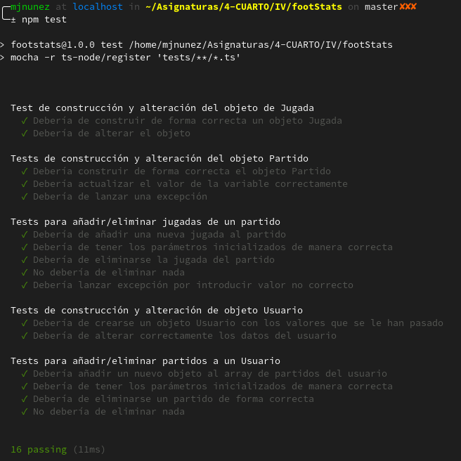

# Desarrollo basado en pruebas
**Ejercicio 1.** Descargar y ejecutar las pruebas de alguno de los proyectos anteriores, y si sale todo bien, hacer un pull request a alguno de esos proyectos con tests adicionales, si es que faltan (en el momento que se lea este tema).

Ya tengo un proyecto al que le puedo ejecutar los tests (el que estoy desarrollando para esta misma asignatura).

**Ejercicio 2.** Para la aplicación que se está haciendo, escribir una serie de aserciones y probar que efectivamente no fallan. Añadir tests para una nueva funcionalidad, probar que falla y escribir el código para que no lo haga (vamos, lo que viene siendo TDD).

Ya están hechos los tests de la aplicación que estoy desarrollando para esta asignatura. El directorio de tests se puede consultar [aquí](https://github.com/ManuelJNunez/footStats/tree/master/tests)

**Ejercicio 3.** Crear algún conjunto de scripts de tests, usando tu lenguaje favorito, y ejecutarlos desde el marco de test más adecuado (o el que más te guste) para ese lenguaje.

Ya he creado un conjunto de tests usando TypeScript y mocha+chai (ver ejercicio 2).