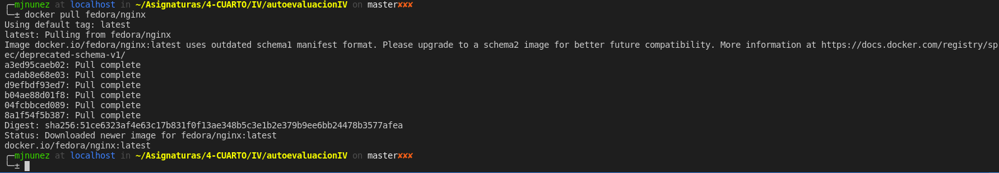

# Virtualización ligera usando contenedores

**Ejercicio 1.** Instalar docker y/o otro gestor de contenedores como Podman/Buildah.

**Ejercicio 2.** 
1. Instalar a partir de docker una imagen alternativa de Ubuntu y alguna adicional, por ejemplo de CentOS.

2. Buscar e instalar una imagen que incluya MongoDB.

