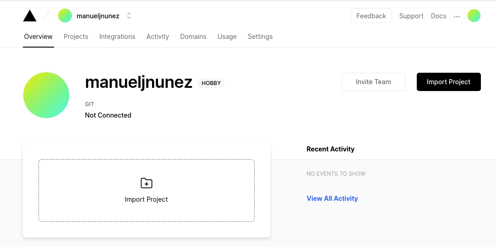
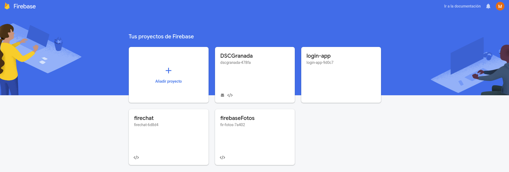
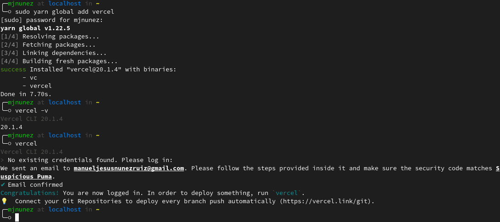
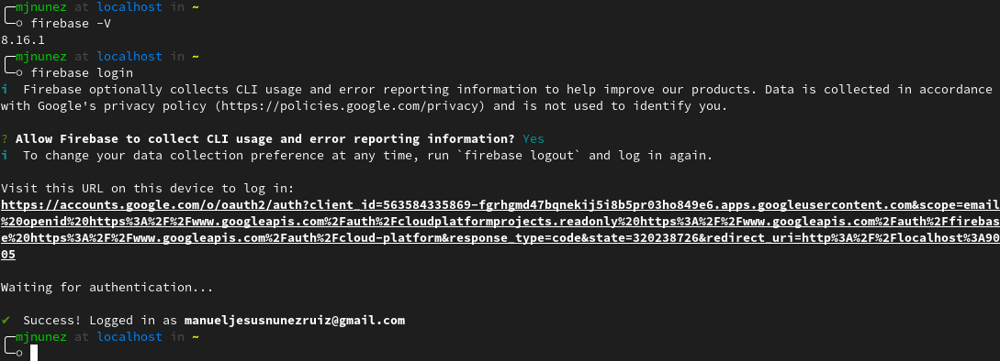
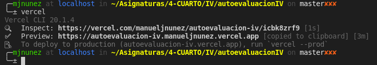
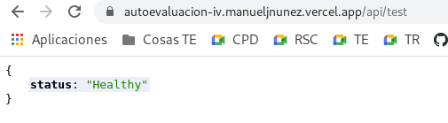
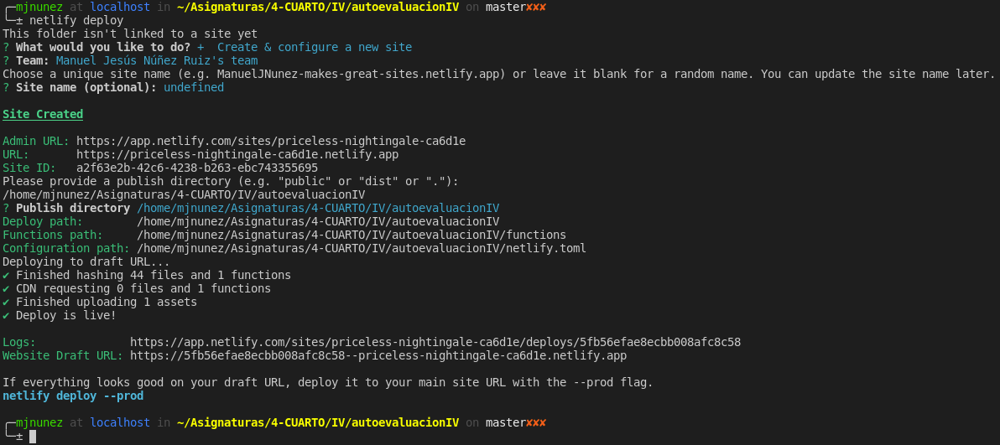
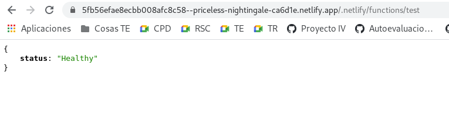

# Serverless computing

**Ejercicio 1.** Darse de alta en Vercel y Firebase, y descargarse los SDKs para poder trabajar con ellos localmente.

Las siguientes capturas muestran que me he dado de alta en ambos servicios. En `Firebase` ya estaba dado de alta de antes, se puede ver que ya tengo unos proyectos de antes.

En las siguientes capturas se muestra la instalación y login en `Vercel CLI` y en `Firebase CLI`.

**Ejercicio 2.** Tomar alguna de las funciones de prueba de Vercel, y hacer despliegues de prueba con el mismo.

En este caso he probado [esta función](../api/test.js) en `Vercel`.

**Ejercicio 3.** Tomar alguna de las funciones de prueba de Netlify, y hacer despliegues de prueba con el mismo.

