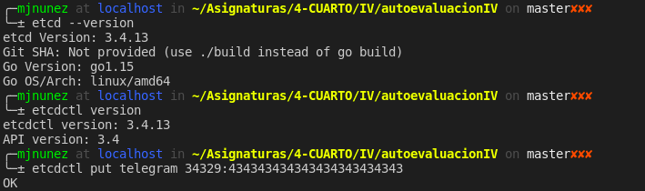
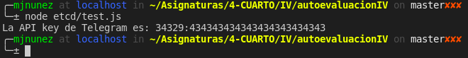

# Microservicios

**Ejercicio 1.** Instalar `etcd3`, averiguar qué bibliotecas funcionan bien con el lenguaje que estemos escribiendo el proyecto (u otro lenguaje), y hacer un pequeño ejemplo de almacenamiento y recuperación de una clave; hacer el almacenamiento desde la línea de órdenes (con `etcdctl`) y la recuperación desde el mini-programa que hagáis.

La biblioteca que funciona bien con el lenguaje `JavaScript` o `TypeScript` se llama `etcd3`. El minoprograma se encuentra [aquí](../etcd/test.js).

