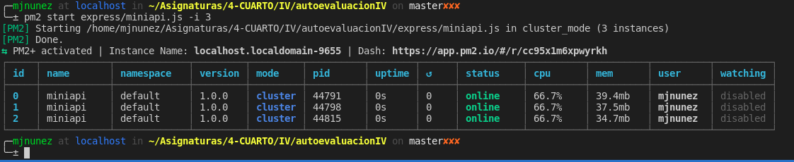
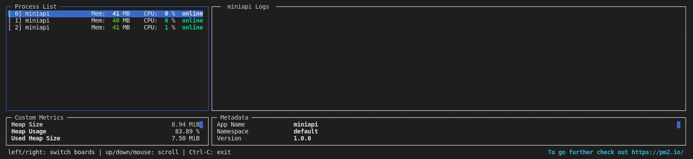

# Microservicios

**Ejercicio 1.** Instalar `etcd3`, averiguar qué bibliotecas funcionan bien con el lenguaje que estemos escribiendo el proyecto (u otro lenguaje), y hacer un pequeño ejemplo de almacenamiento y recuperación de una clave; hacer el almacenamiento desde la línea de órdenes (con `etcdctl`) y la recuperación desde el mini-programa que hagáis.

La biblioteca que funciona bien con el lenguaje `JavaScript` o `TypeScript` se llama `etcd3`. El minoprograma se encuentra [aquí](../etcd/test.js).

**Ejercicio 2.** Realizar una aplicación básica que use `express` para devolver alguna estructura de datos del modelo que se viene usando en el curso.

Se encuentra [aquí](../express/miniapi.js).

**Ejercicio 3.** Programar un microservicio en express (o el lenguaje y marco elegido) que incluya variables como en el caso anterior.

Se han añadido nuevos métodos al fichero del ejercicio anterior.

**Ejercicio 4.** Crear pruebas para las diferentes rutas de la aplicación.

Los tests se han creado [aquí](../test/express.test.js).

**Ejercicio 5.** Experimentar con diferentes gestores de procesos y servidores web front-end para un microservicio que se haya hecho con antelación, por ejemplo en la sección anterior.

Voy a experimentar con `pm2` (he probado forever y strongloop pero me han dado problemas)

**Ejercicio 6.** Usar `rake`, `invoke` o la herramienta equivalente en tu lenguaje de programación para programar diferentes tareas que se puedan lanzar fácilmente desde la línea de órdenes.

Voy a usar npm, la orden la añado [aquí](../package.json), en el `package.json`.
