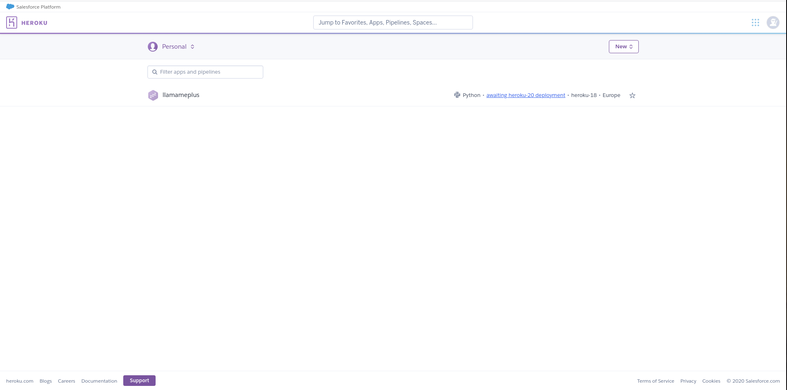

# Platform as a Service

**Ejercicio 1.** Darse de alta en algún servicio PaaS tal como Heroku o BlueMix o usar alguno de los PaaS de otros servicios cloud en los que ya se esté dado de alta.

Ya estoy dado de alta en Heroku. De hecho hasta tengo un proyecto subido de antes.

**Ejercicio 2.** Crear una aplicación en OpenShift o en algún otro PaaS en el que se haya dado uno de alta. Realizar un despliegue de prueba usando alguno de los ejemplos incluidos con el PaaS.

